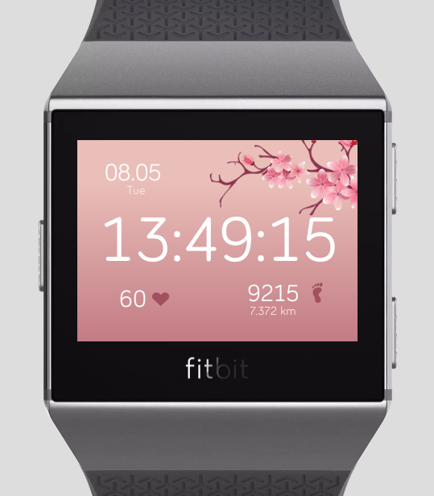

# Fitbit Watch Face

Features:
- Add seconds
- Have distance, steps, heart rate

Assets used:
- Sakura: https://www.cleanpng.com/png-cherry-blossom-flower-sakura-672076/
- Heart: https://webdesign.tutsplus.com/tutorials/how-to-make-an-animated-beating-heart-with-svg--cms-32759
- Footprint: https://www.pngwave.com/png-clip-art-nwdcu

Resources:
- https://dev.fitbit.com/build/guides/sensors/heart-rate/
- https://dev.fitbit.com/build/guides/user-interface/svg/

TODO: 
Additional features:
- Start timing run
